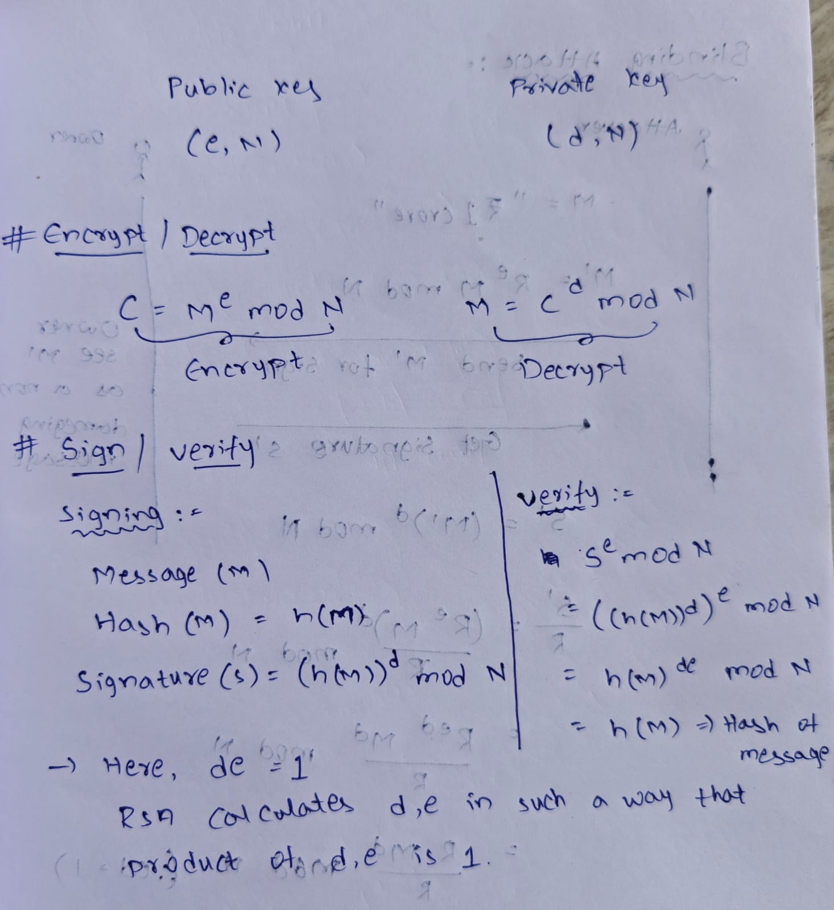
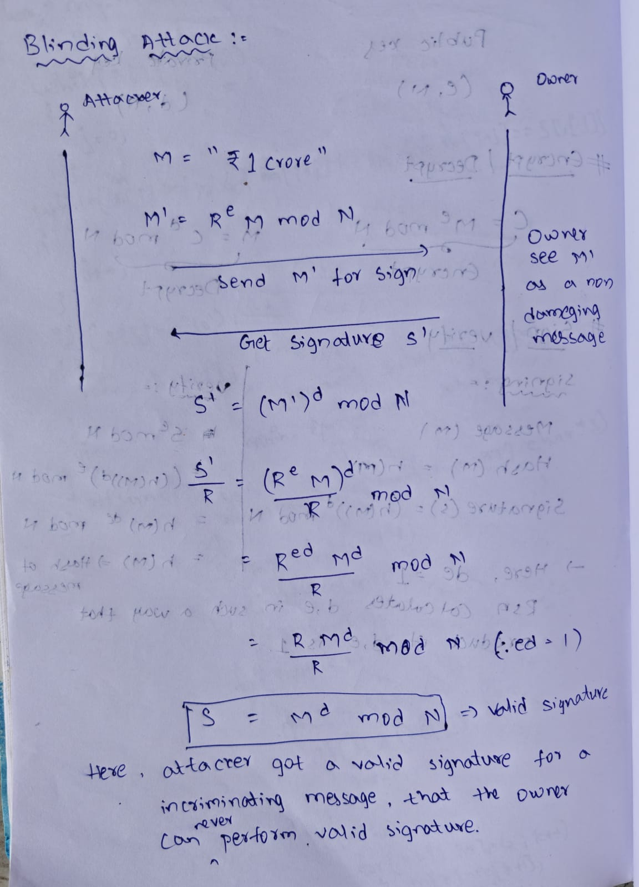

# What is RSA?
RSA (Rivest-Shamir-Adleman) is an asymmetric(public key) cryptographic algorithm.
It uses
- One key for encryption/decryption -> Public key
- Another key for decryption/signature -> private key

RSA is used for
- Encrypting small data (like symmetric keys)
- Digital Signatures
- Key exchange (TLS handshake)
- Secure email (S/MIME, CMS)
- Cryptographic tokens

## How RSA works internally
RSA security is based on math problem
- Given N = p x q (product of two large primes), it is easy to multiply p and q but extremly hard to factor N.
- Finding p and q from N is extremely hard

### Common RSA key lengths

| RSA Key Length | Security Level             | Used For                 |
| -------------- | -------------------------- | ------------------------ |
| **1024 bits**  | Weak today (can be broken) | Not recommended          |
| **2048 bits**  | Good security              | Default for most systems |
| **3072 bits**  | Strong                     | Long-term security       |
| **4096 bits**  | Very strong                | High-security apps       |
| **8192 bits**  | Overkill / slow            | Rarely used              |


## RSA key-pair generation

#### `Step 1` - Choose two large random prime numbers

```text
p, q (each 1024 bits for RSA-2048)
```

#### `Step 2` - Compute modulus
```text
N = p x q
```
- N is part of public and private key

#### `Step 3` - Compute Euler's totient
```text
φ(N) = (p−1)(q−1)
```

#### `Step 4` - Choose public exponent `e`
The public exponent `e` is typically `65537`
It is used for below reasons
- Fast exponentiation
- Hard to attack
- Widely standardized

#### `Step 5` - Compute private exponent `d`
```text
d = e⁻¹ mod φ(N)
```
`d` is a modular multiplicative inverse.

So the keys are:
##### Public key = (N,e)
##### Private key = (N, d)
and optional CRT params: p, q, dp, dq, qinv

### RSA key-gen example

| Component            | Value        |
| -------------------- | ------------ |
| p                    | 61           |
| q                    | 53           |
| N = p × q            | 3233         |
| φ(N)                 | 3120         |
| e (public exponent)  | 17           |
| d (private exponent) | 2753         |
| Public Key           | (17, 3233)   |
| Private Key          | (2753, 3233) |

### CRT params
CRT = Chinese Remainder Theorem

When decrypting or signing, RSA normally needs to compute
```text
m = c^d mod N
```

This operation is slow because:
- `d` is large
- `N` is large (2048-bit or 4096-bit)

To speed things up, RSA uses CRT to break this into two smaller exponentiations - one modulo `p`, one module `q`

The CRT params includes
- dp = d mod (p-1)
- dq = d mod (q-1)
- qinv = q⁻¹ mod p 

#### Why RSA private keys store dp, dq, qinv?
- They speed up private key oeprations
- They are required for CRT reconstruction

A PEM/DER encoded private and public key consists like this

#### PEM public key
```text
Modulus (n)
Exponent (e)
```

#### PEM private key
```text
Modulus (n)
PublicExponent (e)
PrivateExponent (d)
Prime1 (p)
Prime2 (q)
Exponent1 (d mod (p-1))
Exponent2 (d mod (q-1))
Coefficient (q^{-1} mod p)
```

## RSA encryption/decryption

RSA's core mathematical property

> Enryption

```text
(m^e mod N) = CipherText
```

> Decryption

```text
(CipherText)^d mod N = m
```

where
- `m` is message
- `e` is public exponent
- `d` is private exponent
- `N` is modulus


### Problems in textbook RSA Encryption

1. RSA encryption is deterministic

- If we encrypt the same plaintext twice, we will get the same cipher text twice.

```text
Message          Ciphertext

"YES"       →    ABC123
"NO"        →    XYZ789
"YES"       →    ABC123
"YES"       →    ABC123
```

2. RSA encryption is malleable

Given two RSA textbook ciphertexts,

```txt
y1 = (X1 ^ e) mod n

y2 = (X2 ^ e) mod n
```

Where

y1, y2 are ciphertexts
X1, X2 are plain texts

We can derive the ciphertexts of X1 x X2 by multiplying the two CipherTexts y1,y2 like this

```txt
(y1 x y2) mod n == ((X1 ^ e) x (X2 ^ e)) mod n == ((X1 x X2) ^ e) mod n
```

The result is `((X1 x X2) ^ e) mod n`, the ciphertext of the message `(X1 x X2) mod n`.
The attacker could create a new ciphertext from two RSA ciphertexts, allowing them to compromise the security of our encryption by letting them deduce info about original message. 


### RSA encryption process
- RSA uses public key for encryption
- If we are encrypting message `m` then
```text
ciphertext = m^e mod N
```
- m is not the raw message, it must be padded first

#### `Step 1` - Convert message into bytes
"HELLO" -> `48 45 4C 4C 4F"

#### `Step 2` - Add padding
For PKCS#1 v1.5
```text
EM = 0x00 || 0x02 || random nonzero bytes || 0x00 || message
```

For OAEP:
- Use hash
- Mask Generation Function (MGF)
- XOR masks
- Strong padding

#### `Step 3` - Convert padded block EM into integer m
#### `Step 4` - Perform RSA public-key operation
```text
c = m^e mod N
```

where `c` is the cipher text

### RSA decryption process
- RSA uses private key for decryption
- For a given ciphertext `c`

```text
m = c^d mod N
```

#### `Step 1` - Peform RSA private key operation
```text
EM = c^d mod N
```

#### `Step 2` - Remove padding
For PKCS#1 v1.5
- Perform PKCS#1 structure verification
- Must begin with `00 02`
- Random padding bytes untill `00`

For OAEP:
- Unmask using MGF
- Validate hash

- Original message is extracted

## RSA sign/verify
RSA signatures are based on the same as RSA enbcryption, but in reverse order.
- Signing uses the private key `d`
- Verify uses the public key `e`

This is possible because of below property

#### Sign

```text
(m^d mod N) = S
```

#### Verify

```txt
S^e mod N = m 
```

- RSA never signs the raw messages, it signs the hash that is wrapped in ASN.1 structure (PKCS#1 v1.5) or padded using RSA-PSS.

### Problems in textbook RSA signature

#### Problem #1

Upon noticing that `(0 ^ d) mod n = 0`, `(1 ^ d) mod n = 1` and `(n - 1) ^ d mod n = n - 1`

regardless of the value of the private key d, an attacker can forge signatures of 0, 1 and n-1 without knowing d.

#### Problem #2 - Blinding Attacking






### RSA signing 
Private key used for signing

#### `Step 1` - Calculate message hash
```text
H = SHA-256(message)
``` 

#### `Step 2` - Wrap hash in DigestInfo (ASN.1)
For PKCS#1 v1.5, RSA signs this structure
```text
DigestInfo = ASN1_encode( OID_of_SHA256 + H )
```
- OID Hash Algorithm is used to tell the verifier, what is the hashing algorithm used when signing.

#### `Step 3` - Pad using PKCS#1 v1.5
Construct a block of length equal to RSA modulus size
```text
EM = 0x00 || 0x01 || FF FF FF ... FF || 0x00 || DigestInfo
```

Example for 2048-bit RSA
- Total = 256 bytes
- FF padding  = 256 - 3 - len (DigestInfo)

#### `Step 4` - Perform RSA private key operation
```text
S = EM^d mod N
```
Where `S` is RSA signature

### RSA verification
Public key is used in RSA verification

#### `Step 1` Compute message hash
```text
H = SHA-256(message)
```

#### `Step 2` - Reverse RSA using public exponent
```text
EM' = S^e mod N
```
This recovers the padded DigestInfo that the signer produced

#### `Step 3` - Check padding
Verify PKCS#1 v1.5 padding
- EM' begins with `0x00 01 FF FF ... 00`
- FF padding length is valid

#### `Step 4` - Parse ASN.` DigestInfo
Extract below values
- Hash algorithm OID
- Digest value

#### `Step 5` - Compare digests
```text
if extracted_digest == H:
       signature is valid
else:
       invalid
```

If calculated_hash or extracted_digest match, signature is valid.

### Why hashing is required?
- RSA can only sign num,bers < N
- Hashing makes input fixed-size
- Signing large message directly is insecure and too slow
- Hash defines message integrity

## RSAES-OAEP

To make RSA encryption non-malleable, the ciphertexts should consist of the message data and some additional data called Padding.

The standard way to encrypt with RSA in this fashion is to use Optimal Asymmetric Encryption Padding (OAEP).

OAEP uses a pseudorandom number generator (PRNG) to ensure indistingushability and nonmalleability.

### How OAEP Encryption works?

In order to encrypt with RSA in OAEP mode, we meed a message (typically a symmetric key, K), a PRNG and two Hash functions.

1. To encrypt K, the encoded message is formed M, `M = H || 00 ... 00 || 01 || K`

> Where, H is h-byte constant defined by OAEP scheme, followed by as many 00 bytes needed and a 01 byte

2. Next a h-byte random string R is generated.

3. Calculate M' as `M' = M ⊕ Hash1(R)`

> Where, Hash1(R) is as long as M.

4. Calculate R' as `R' = R ⊕ Hash2(M')`
> Where, Hash2(M') is as long as R

5. Use M' and R', to form an m-byte string P, `P = 00 || M' || R'`
> Where, P is as long as the modulus n and can be converted to integer less then n

6. The result of this conversion is the number x, which is used to compute the RSA function `x ^ e mod n` to get the ciphertext.


### OAEP Decryption

To decrypt the cipertext y, 

1. Compute `x = y ^ d mod n`, and recover the values of M' and R'.

2. Retrive initial value of M by computing `M' ⊕ Hash1(R' ⊕ Hash2(M'))`

3. Verify if M is of format `H || 00 . . . 00 || 01 || K` and get the Key (K).

In practice the parameters m and h (length of modulus and length of Hash2's output) is m = 256 bytes (for RSA 2048 bytes) and h = 32 (for SHA256 as Hash2).

M size is 223 bytes (m - h - 1). This is the same output size as of Hash1

K has size of 190 bytes (m - 2h - 2)

OAEP block

```txt
P
┌────┬───────────────────────────────┬────────────────┐
│ 00 │          M' (223)             │    R' (32)     │
│ 1  │                               │                │
└────┴───────────────────────────────┴────────────────┘
       223 bytes                       32 bytes

       1 + 223 + 32 = 256
```

Inside M, before masking

```txt
M
┌────────────┬───────────────┬────┬────────────────┐
│ H (32)     │ 00...00       │ 01 │ K (max 190)    │
└────────────┴───────────────┴────┴────────────────┘

32 + padding + 1 + 190 = 223
```

- In order to build a hash with such unusual length, RSA standard describes the use of Mask Generator Function technique to create hash functions that are arbitrarily large hash values from any hash functions.


## RSAPSS

The RSA Probabilistic Standard Scheme (PSS) is to RSA signature what OAEP is for RSA encryption.

It was designed to make message signing more secure, because of addition of padding data.

Like OAEP, PSS also requires a PRNG and two hash functions.
- One Hash1, is a typical hash with h-byte hash values such as SHA-256
- Other Hash2, is a wide output hash like OAEP Hash2


### How PSS signature procedure works

For a message M

1. Pick a r-byte random string R using PRNG

2. Form an encoded message `M' = 0000000000000000 || Hash1(M) || R`, long of h + r + 8 bytes

3. Compute the h-byte string `H = Hash1(M')`

4. Set `L = 00...00 || 01 || R`, here the number of 00 bytes can be as long as the length of L is equal to m - h - 1

5. Set `L = L ⊕ Hash2(H)`

6. Convert the m-byte string `P = L || H || BC` to a number x, lower than n. Here, BC is a fixed value appended after H.

7. Given the value of x, compute RSA function `x ^ d mod n` to obtain signature.

To verify the signature given a message, M, compute Hash1(M) and use public compoent e and N to retrieve the L and H, and then M' from the signature, checking the padding at each step.


In PSS standard, the R is often called *Salt* as is as long as hash value.

For example, if you use n = 2048 bits and SHA-256 as hash, the value L is long of `m - h - 1 = 256 - 32 - 1 = 223 bytes.` And random string R would be of length 32 bytes.

## PKCS #1

### Encryption Schemes (ES)

1. RSAES-OAEP 
2. RSAES-PKCS1_v1_5 (Older RSA Encryption)

### Signarture Schemes with Appendix (SSA)

1. RSASSA-PSS
2. RSASSA-PKCS1_v1_5 (Older RSA Signatures)