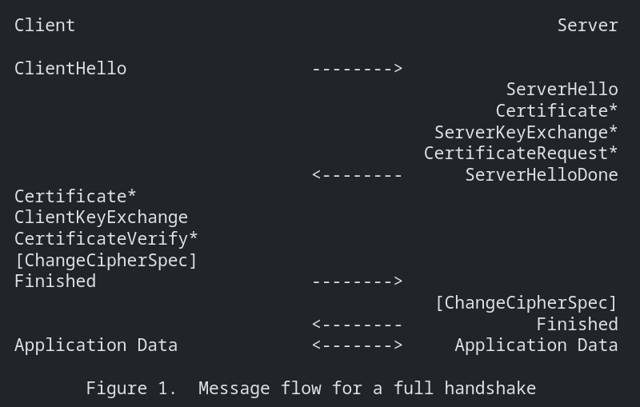
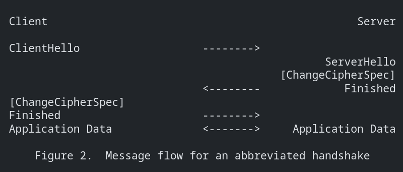

The TLS protocol consists of two layers,
1. TLS Record Protocol
2. TLS Handshake protocol

## TLS Record Protocol

It is a layered protocol. At each layer, messages may include fields of length, description and content.

When data needs to be transmitted, the protocol performs below operations
1. Fragments data to managable blocks
2. Optionally compressess the data
3. Applies MAC
4. Encrypts

And transmits the data.

When data is received, 
1. Data is decrypted
2. Verified
3. Decompressed
4. reassambled
And delivered to higher level clients.


Protocols using TLS Record Protocol
1. Handshake Protocol
2. Alert Protocol
3. Change Ciper Protocol
4. Application data Protocol

### Connection states in TLS Record Protocol
four connection states: 
1. the current 
    1. read state
    2. write state
    
2. the pending 
    1. read state
    2. write state

### Security parameters for a TLS Connection read and write state 

connection end
    Whether this entity is considered the "client" or the "server" in this connection.

PRF algorithm
    An algorithm used to generate keys from the master secret

bulk encryption algorithm
    An algorithm to be used for bulk encryption.

MAC algorithm
    An algorithm to be used for message authentication.

compression algorithm
    An algorithm to be used for data compression.

master secret
    A 48-byte secret shared between the two peers in the connection.

client random
    A 32-byte value provided by the client.

server random
    A 32-byte value provided by the server.


## TLS Handshake protocol

TLS Handshake protocol has three sub protocols. These three protocols are used to allow peers to agree upon security parameters for the record layer. Which includes below operations
1. Authenticate themselves
2. Instantiate negotiaged security params
3. Report error conditions to each other

The Handshake protocol is responsible for negotiating a session, which consists of

session identifier
    An arbitrary byte sequence chosen by the server to identify an active or resumable session state.

peer certificate
    X509v3 certificate of the peer

compression method
    The algorithm used to compress data prior to encryption

cipher spec
    1. Specifies the pseudorandom function (PRF) used to generate keying material
    2. The bulk data encryption algorithm (such as null, AES, etc.)
    3. The MAC algorithm (such as HMAC-SHA1).

master secret
    48-byte secret shared between the client and server.

is resumable
    A flag indicating whether the session can be used to initiate new connections.

### Change Cipher Spec Protocol

Change Ciper Spec protocol exists to signal transitions in ciphering message.
The protocol consists of a single message of single byte value.

The ChangeCipherSpec message is sent by both the client and server to notify the upcoming or subsequent messages will be protected under newly negotiated cipherspec and keys.

### alert Protocol
alert messages convey the severity of message (warning or fatal) and description of the alert.

alert messsages of with level of fatal result in immediate termination of the connection.
In this case the other connection states may continue but the session identifier must be invalidated, to prevent the failed sessions to be used in new connections.

alert messages are encrypted and compressed as specified in current connection state.

##### Alert description:
    close_notify(0),
    unexpected_message(10),
    bad_record_mac(20),
    decryption_failed_RESERVED(21),
    record_overflow(22),
    decompression_failure(30),
    handshake_failure(40),
    no_certificate_RESERVED(41),
    bad_certificate(42),
    unsupported_certificate(43),
    certificate_revoked(44),
    certificate_expired(45),
    certificate_unknown(46),
    illegal_parameter(47),
    unknown_ca(48),
    access_denied(49),
    decode_error(50),
    decrypt_error(51),
    export_restriction_RESERVED(60),
    protocol_version(70),
    insufficient_security(71),
    internal_error(80),
    user_canceled(90),
    no_renegotiation(100),
    unsupported_extension(110),

#### Closure alerts
The client and server must share the knowledge of the connection closure to avoid truncation attack.
Either party can initiate the exchange of closure message.

close_notify
    This message notifies the recipient that sender will not send any more messages on this connection.

Any data received after the closure alert is ignored.

#### Error alerts
Error handdling is simple in TLS Handshake protocol. When an error is detected, the detecting party sends a message to the other party.

Upon transmission or receipt of fatal alert message, both the parties immediately closes the connection. 

Servers and clients must forget any session-identifiers, keys and secrets associated with a failed connection. Any connection terminated with fatal alert must not be resumed.

A connection can continue normally, when a alert message of level warning is recevied.

More about warnings can be found [here](datatracker.ietf.org/doc/html/rfc5246#section-7.2.2).

### Handshake protocol overview
The Cryptographic parameters of the session state are produces by the TLS Handshake protocol, which operates on top of TLS record layer.

When a TLS client and server first start communication, they agree upon 
1. Protocol version
2. Select Cryptographic algorithms
3. Optionally authenticate each other
4. Use public key encryption techniques to generate shared secrets.

The TLS Handshake Protocol involves the following steps:
   -  Exchange hello messages to agree on algorithms, exchange random values, and check for session resumption.

   -  Exchange the necessary cryptographic parameters to allow the client and server to agree on a premaster secret.

   -  Exchange certificates and cryptographic information to allow the client and server to authenticate themselves.

   -  Generate a master secret from the premaster secret and exchanged random values.

   -  Provide security parameters to the record layer.

   -  Allow the client and server to verify that their peer has
      calculated the same security parameters and that the handshake
      occurred without tampering by an attacker.


1. Hello Phase

    The client sends a ClientHello message to which the server must responds with a ServerHello message, or else a fatal error will occur and connection will fail.
    
    The ClientHello and ServerHello are used to establish security enchancement capabilities between server and client.

    The ClientHello and ServerHello has following attributes
    1. Protocol version
    2. Session ID
    3. Cipher suite
    4. Compression Method
    5. ClientHello.Random and ServerHello.Random

2. Following hello messages, the server will send it's certificate if it is needs to be authenticated. Additionally a ServerKeyExchange message may be sent, if it is required (e.g., if server has no certificate, or if its certificate is for signing only).

3. If Server certificate is verified, server may request a certificate (CertificateRequest) from the client. 

4. Next the server will send ServerHelloDone message, indicating hello-message phase has been completed. And will wait for the client's response.

5. If the Server has sent a CertificateRequest, the client MUST send the Certficate Message.

6. The ClientKeyExchange message is sent now and the content of this message will depend on the public key algorithm selected between ClientHello and ServerHello.

7. If the client has sent a certificate with signing ability, the client will send a digitally signed CertificateVerify message, to verify the possesion of the private key in the certificate.

8. At this point the client sends a ChangeCipherSpec message. Then Client sends the Finished message under the new algorithms, keys and secrets.

9. In response the server will send its ChangeCipherSpec message. And send it's Finished message under the new algorithms, keys and secrets.

10. At this point the handshake is complete. The client and server may start the transfer of Application data.

11. Application data must not be sent, prior to handshake completion, except for cipher suite other than TLS_NULL_WITH_NULL_NULL is established.




#### Session Resumption
When a client and server decide to resume a previous session, the message is as follows:

The client sends the Session ID in the ClientHello, the Server Checks the session cache for match. If a match is found, the server is willing to re-establish the connection under specified state. The Server sends the ServerHello with the same SessionID value.

Both server and client must send ChangeCipherSpec message and proceed directly to Finished message.



### Handshake Protocol

#### CipherSuites list

#### Signature Algorithms
The client uses the "signature_algorithms" extenstion to indicate the sserver to use which hash/signature algorithms pair.

hash - this field indicates the hash algorithm which may be used. 
        MD5, SHA-1, SHA-224, SHA-256, SHA-384 and SHA-512

signature - this field indicates the signature algorithm that may be used.
        RSASSA-PKCS1-v1.5, DSA and ECDSA.

If client doesnot send the signature_algorithms extension, server MUST do the following:

-   If negotiaged key exchange algo is one of (RSA, DHE_RSA, DH_RSA, RSA_PSK, ECDH_RSA, ECDHE_RSA), behave as if client had sent value {SHA1, RSA}

-   If negotiaged key exchange algo is one of (RDHE_DSS, DH_DSS), behave as if client had sent value {SHA1, dsa}

-   If negotiaged key exchange algo is one of (ECDH_ECDSA, ECDHE_ECDSA), behave as if client had sent value {SHA1, ecdsa}

Note: When Session resumption is performed, this extension is not included in ServerHello and server ignores the extension in ClientHello if present.

## ClientKeyExchange message
It is first message to be send by client following Client Certificate message or otherwise after SeverHelloDone message is received.

With this message, the premaster secret is set. Which is done by either by direct transmission of the RSA-encrypted secret or by the transmission of Diffie-Hellman parameters that will allow each side to agree upon the same premaster secret.

### RSA-Encrypted Premaster Secret Message

If RSA is being used for key agreement and authentication, the client generates a 48 byte premaster secret, encrypts it using server's public key from the server's certificate and sends the result in an encrypted premaster secret message.

### Client Diffe-Hellman Public value
This structure conveys the client's Diffie-Hellman public value (Yc) if it was not already included in the client's certificate. The encoding used for Yc is determined by the enumeratedd PublicValueEncoding.

If the client has sent a certificate which contains a suitable Diffie-Hellmaan key (ffor fixed_dh client authentication), then Yc is implicit and does not need to be sent again. In this case, the client key exchange will be sent, but it MUST be empty.

## Certificate Verify
This message is used to provide explict verification of the client certificate. This messsage is only sent following a client certificate that has a signing capability. This messsage is sent immediately following client key exchange message.

Content of this message, will be\
-   `algorithm` : Indicates the signature algorithm.
-   `signature` : Digital signature over a hash of all prior handshake message from Client Hello upto CertificateVerify (not included).

## Finished
A finished message is always sent immediately after a change chiper spec message to verify that the key exchange and authenticiation processes were successful.

The finished message is the first one protected with the just negotiated algorithms, keys and secrets. After this message have been verified and validated by the peers, the peers can begin to send and receive application data over the secured connection.

## Computing the master secret
For all key exchange methods, the same algorithm is used to convert the pre_master_secret into the master_secret. The pre_master_secret should be deleted from the memory once the master_secret has been computed.

```sh
master_secret = PRF(pre_master_secret, "master secret",
                    ClientHello.random + ServerHello.random)[0..47];
```

The master_secret is always excatly 48 bytes in length. The length of the premaster secret will vart depending on the key exchange method.

### RSA
When RSA is used for server authentication and key change, a 48-byte pre_master_secret is generated by the client. The pre_master_Secret is encrypted under the server's public key and sent to the server. 

The server uses its private key to decrypt the pre_master_secret. Both the parties convert the pre_master_secret into the master_secret as specified above.

### Diffie-Hellman
A conventional Diffe-Hellman computation is performed. The negoziated key (Z) is used as pre_master_secret and is converted into the master_secret as specified above. Leading bytes of Z that contain all zero bits are stripped before it is used as the pre_master_secret.