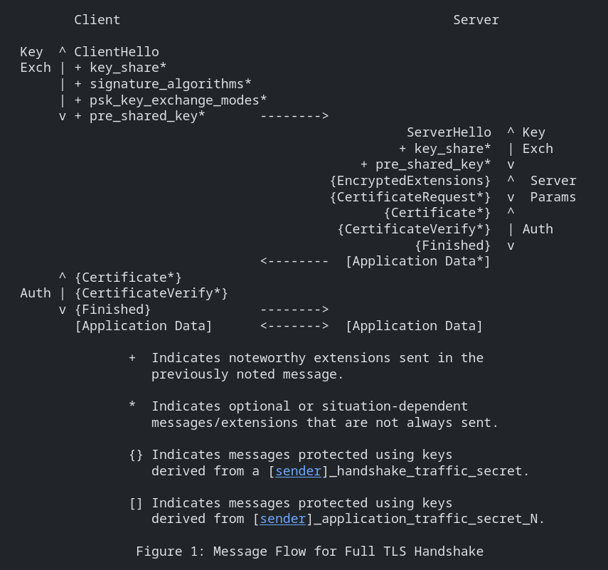
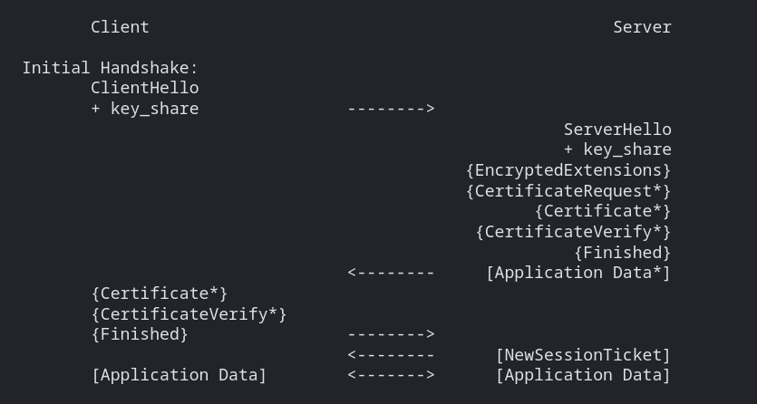
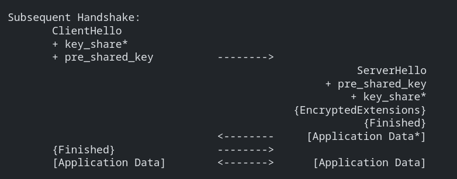
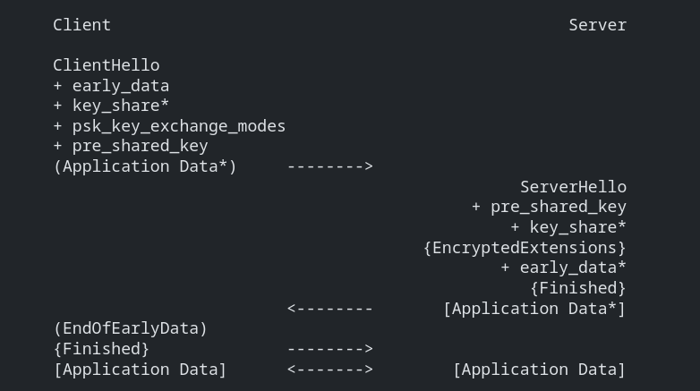
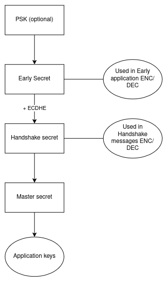
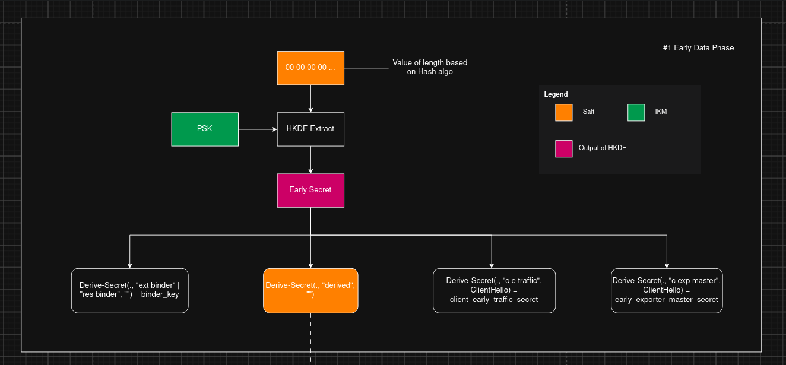
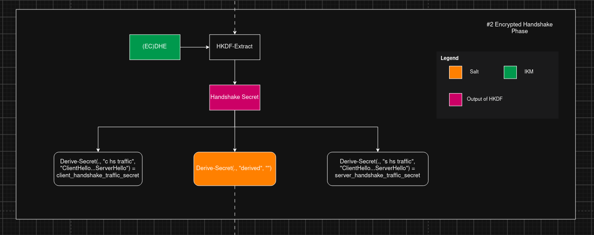
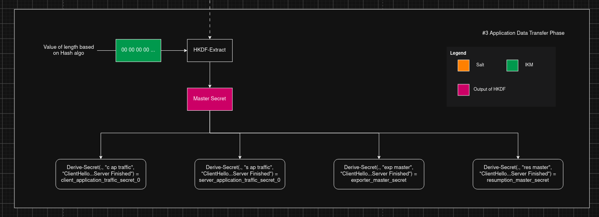

## TLS 1.3 handshake



The handshake can be thought of having three phases

#### 1. Key exchange
Establish shared keying material and select the crypto graphic parameters. After this everything is encrypted.

#### 2. Server Parameters
Establish other handshake parameters (whether client is authenticated, application layer protocol support, etc)

#### 3. Authentication
Authenticate the server (optionally the client) and provide key confirmation and handshake integrity.

### Types of key exchange modes

TLS 1.3 supports three basic key exchange methods
1. (EC)DHE (Diffe-Hellman over finite fields or elliptic curves)
2. PSK-only
3. PSK with (EC)DHE

### Resumption and pre-shared key (PSK)

- TLS PSK can be established out of bound such as hardcoding the keys or pre-intalling the keys.
- PSK's can also be established in a previous connection and used in subsequent connections.
- After a successful handshake, the server can share the PSK identity that corresponds to the unique key derived from inital handshake.
- The client can use the PSK identity in future handshake to negotiate the use of associated PSK. If server accepts the identity, the PSK attached to previous connection can be used in the current hanshake.
- In  TLS 1.2 and lower versions, this was taken care by "Session ID" or "Session Tickets". Both are obsoleted in TLS 1.3.

- PSK's can be used with (EC)DHE key exchange in order to provide forward secrecy in combination with shared keys.
- Or can be used alone, at the cost of losing forward secrecy for application data.





- When client offers resumption via PSK, it should also supply a "key_share" extension to server, in case server declines authencation via resumption and fallbacks to full handshake.

- The server responds with a "pre_shared_key" extension to negotiate the use of PSK key establishment and respond with "key_share" extension to do (EC)DHE key establishment, for forward secrecy.

### 0-RTT

RTT - Round Trip Time

- When clients and servers share a PSK, TLS 1.3 allows clients to send data on the first flight (early data).
- The client uses the uses the PSK to authenticate the server and encrypt early data.
- The 0-RTT data is just added to the 1-RTT handshake in the first flight. Rest of the handshake uses the same messages as for the 1-RTT handshake with PSK resumption.



- The security properties of 0-RTT are weaker when compared to other kinds of TLS data.
- This data is not forward secret, as it is encrypted solely using the keys derived from the offered PSK.
- There are no guarantees of non-replay between connections. Protection against replay for ordinary TLS 1.3 1-RTT data is provided by server random value. And 0-RTT doesnot depends on the ServerHello.

- 0-RTT data cannot be duplicated within a connection. i.e., the server will not process the same data twice for the same connection.
- An attacker will not be able to make 0-RTT data as 1-RTT data, because 0-RTT data is encrypted with different keys.

### Cryptographic computations

TLS 1.3 has three cryptographic stages.



TLS 1.3 derives keys from two possible input secrets:

1. PSK

    - External PSK
    - Resumption PSK

2. (EC)DHE shared secret - Generated during handshake

#### Key schedule

The key derivationn process makes use of the HKDF-Extract and HKDF-Expand functions as defined for HKDF [RFC5869](https://datatracker.ietf.org/doc/html/rfc5869) and as defined in below:

```txt
HKDF-Expand-Label(Secret, Label, Context, Length) =
            HKDF-Expand(Secret, HkdfLabel, Length)
```

```txt
Derive-Secret(Secret, Label, Messages) = 
        HKDF-Expand-Label(Secret, Label, 
        Transcript-Hash(Messages), Hash.length)
```

Where 

- HkdfLabel is:

```c
struct {
    uint16 length = Length;
    opaque label<7..255> = "tls13 " + Label;
    opaque context<0..255> = Context;
} HkdfLabel;
```
- The hash function used by Transcript-Hash and HKDF is the cipher suite hash algorithm.
- Hash.length is output length in bytes
- Messages is the concatination of the indicated handshake messages, including the handshake message type and length fields, but not including the record layer headers.


Keys are derived from two input secrets using the HKDF-Extract and Derive-Secret functions. The general pattern for adding a new secret is to use HKDF-Extract with the __Salt being the current secret state__ and the __Input Keying Material(IKM) being the new secret__ to be added.

#### HKDF basics

```txt
HKDF_Extract(
    salt,
    input_keying_material
)
```
Produces a pseudorandom secret.

Example:

```txt
salt = previous secret
IKM = new secret

HDF_Extract(salt, IKM) = new secret
```

TLS doesn't directly use HKDF_Extract, instead uses

```txt
HKDF-Expand-Label(
    secret,
    label,
    context,
    length
)
```

Example:

```txt
HKDF-Expand-Label(
    handshake_secret,
    "c hs traffic",
    transcript_hash,
    32
)
```

For handshake_secret, generate a 32-byte client handshake traffic secret


#### Why use HKDF?

TLS 1.3 replaced the TLS 1.2 PRF with HKDF.

TLS 1.2

```txt
Pre-master secret
        |
        v
       PRF
        |
        v
Master secret
```

TLS 1.3

```txt
Secret
   |
   v
HKDF-Extract
   |
   v
New Secret
   |
   v
HKDF-Expand-Label
   |
   v
Specific Key
```

The for use of HKDF is for better key seperation.
Meaning a key used for one purpose cannot accidently reused for another purpose.

```txt
Handshake key != Application key != Resumption key
```

### TLS 1.3 Key Derivation flow





### Important terms in the handshake

#### PSK

PSK stands for Pre Shared Key. It is secret value that both client and server knew before the handshake starts.
Both partities already have the same secret, so they don't need to exchange on the network.

There are two types of PSK's

##### 1. Ressumption PSK

After a successful TLS handshake, the server sends a `NewSessionTicket`. The ticket contains an identity not the PSK.

Lets say after successful handshake, the server creates a new ticket for the PSK

Server stores:

|Ticket|Key|
|---|---|
|Ticket123|AA BB CC DD...|
|Ticket456 (new entry)|99 CC 55 FF...|

The server sends Ticket456 to client in the `NewSessionTicket`, but not the PSK itself.

Client stores:

|Ticket|Key|
|---|---|
|Ticket456|99 CC 55 FF...|

In the upcoming handshake's, the client sends the Identity. Server also finds the same identity.
Now both client and server have the same PSK. Which was never exchanged on the network.

##### 2. External PSK

In some cases, there is no previous TLS connection. Instead both the parties are manually configured with the same secret.

#### key_share

This the client's or server's ephimeral public keys used in Diffie Hellman Key exchange.
Without this the client and server cannot devire the shared secret that becomes the encryption keys.

##### Why this is needed

TLS 1.3 requires ECHDE for key exchange. Insteading of negotiating the algorithm first (as in TLS 1.2), the client directly sends the ephimeral public key to the server.

#### signature_algorithms

This extention tells the server that - `If you authenticate yourself using a certificate, these are the signature algorithms that I understand.`

These sinature algotrihms are used only for verifying the certificates, not for encryption.

##### Example signature_algorithms

```sh
rsa_pss_rsae_sha256
ecdsa_secp256r1_sha256
ed25519
```

#### psk_key_exchange_modes

This extension is only used when `the client wants to resume a previous session or use a pre-shared key (PSK)`.

It indicates server which PSK-based key exchange modes the client supports.

TLS 1.3 defines two modes:

##### Mode 1: `psk_ke`

It uses only PSK. No Diffie-Hellman exchange occurs.

```txt
SHARED SECRET = PSK
```

This doesnot provide forward secrecy.

##### Mode 2: `psk_dhe_ke`

It uses PSK + Diffie-Hellman. The shared secret is derived from both the PSK and Diffie-Hellman exchange.

```txt
SHARED SECRET = PSK + ECDHE
```

This mode does provide forward secrecy.


####  pre_shared_key

The "pre_shared_key" extension is used to negotiate the identity of the pre-shared key to be used with a given handshake in association with the PSK established.

extension structure:

```txt
struct {
    opaque identity<1..2^16-1>;
    uint32 obfuscated_ticket_age;
} PskIdentity;

opaque PskBinderEntry<32..255>;

struct {
    PskIdentity identities<7..2^16-1>;
    PskBinderEntry binders<33..2^16-1>;
} OfferedPsks;

struct {
    select (Handshake.msg_type) {
        case client_hello: OfferedPsks; // sent by client
        case server_hello: uint16 selected_identity; // sent by server
    };
} PreSharedKeyExtension;
```

##### Example extension

```txt
pre_shared_key {

    identities = [

        {
            identity = SessionTicket1
            obfuscated_ticket_age = ...
        },

        {
            identity = SessionTicket2
            obfuscated_ticket_age = ...
        }
    ],

    binders = [

        Binder1,

        Binder2
    ]
}
```

`Identity:` A label for key. A ticket or a label for a pre-shared key established externally.

`Identities:` List of identities that the client is willing to negotiate with the server. 

`Binders:` A series of HMAC values, calculated for each value in the identities list and in the same order, computed as follows.

`selected_identity:` The server's chosen identity expressed as (0-based) index into identites of client's hello.

##### Binder value calculation

```txt
binder_key =
    Derive-Secret(Early Secret,
                  "res binder",
                  "")
```

```txt
Binder = HMAC(binder_key,
     Transcript-Hash(ClientHello_without_binders))
```

