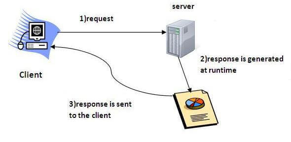

Servlet technology is used to create a web application which resides at server side and generates dynamic web pages.

Servlet api has many classes and interfaces such as
1. Servlet
2. GenericServlet
3. HttpServlet
4. ServletRequest
5. ServletResponse

- To run servelt, we will requrie a server. For that we can use **Apache tomcat server**. To create a client server architecture.
- Normally java code is exported as **JAR** file. (JAVA)
- Servlet code is exported as **WAR** file. (JAVA + HTML/CSS/JS) to create a web application.
- This **WAR** file is deployed to **Tomcat server**.


### Servlet working




#### Container
It is used in java for dynamically generating the web pages on the server side.

#### Server
It is used to manage the network resources and for running the program or software that provides services.

### Servlet project structure

WEB-INF
    - web.xml
    - classes
        - Java files
    
We can create servlet using 
1. Generic Servlet
2. HttpServlet


#### web.xml

**web.xml** is used to tell Tomcat to create object and call which object. Because in servlet we don't have `main()`.

```xml
<web-app>
	<servlet>
		<servlet-name>demo</servlet-name>
		<servlet-class>FirstServlet</servlet-class>
	</servlet>
	<servlet-mapping>
		<servlet-name>demo</servlet-name>
		<url-pattern>/test</url-pattern>
	</servlet-mapping>
</web-app>
```

- Whenever a request is made to `/test` url, Tomcat will check for `servlet-name` defined in `servlet-mapping`.
- Based on `servlet-name`, the corresponding `servlet-class`'s `service()` is called.

### Servlet life cycle

- For the first time when a request is made to particular url, first `init()` is called, next `service()` is called.
- When we undeploy the JAR, `destroy()` will be called.
- For the second time only `service()` is called.
- `catalina` is the `container` in tomcat 10.XX.

### Servlet Example and deploy to Tomcat

```java
// FirstServlet.java
import jakarta.servlet.*;
import java.io.*;

public class FirstServlet extends GenericServlet
{
	@Override
	public void service(ServletRequest req, ServletResponse res) throws ServletException, IOException
	{
		PrintWriter pw = res.getWriter();
		pw.println("Hello from first servlet");
		pw.close();
	}

	@Override
	public void init() throws ServletException{}

	@Override
	public void destroy(){}
}
```

- Compile the First