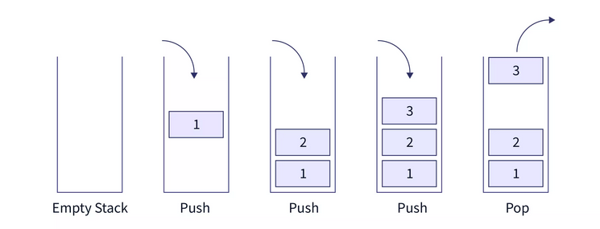

**Stack** is an extension (Child class) of **Vector class**.
Stack follows **LIFO - Last In First Order**.

### Stack implementation



### Methods
|Name|Description|
|----|-----------|
|`boolean empty()`|Returns `true` if stack is empty else `false`|
|`Object peek()`|Returns top element of the stack|
|`Object pop()`|Returns and removes the top element of stack|
|`void push(Object e)`|Adds element to top of the stack|

```java
import java.util.*;
class Example{
    public static void main(String[] args){
        Stack<Integer> stk = new Stack<Integer>();
        stk.push(10);
        stk.push(20);
        stk.push(30);

        System.out.println("Stack is :: " + stk);

        System.out.println("Pop :: " + stk.pop());
        System.out.println("Pop :: " + stk.pop());

        stk.push(40);
        stk.push(50);

        System.out.println("Peek :: " + stk.peek());
    }
}
```

```
Stack is :: [10, 20, 30]
Pop :: 30
Pop :: 20
Peek :: 50
```