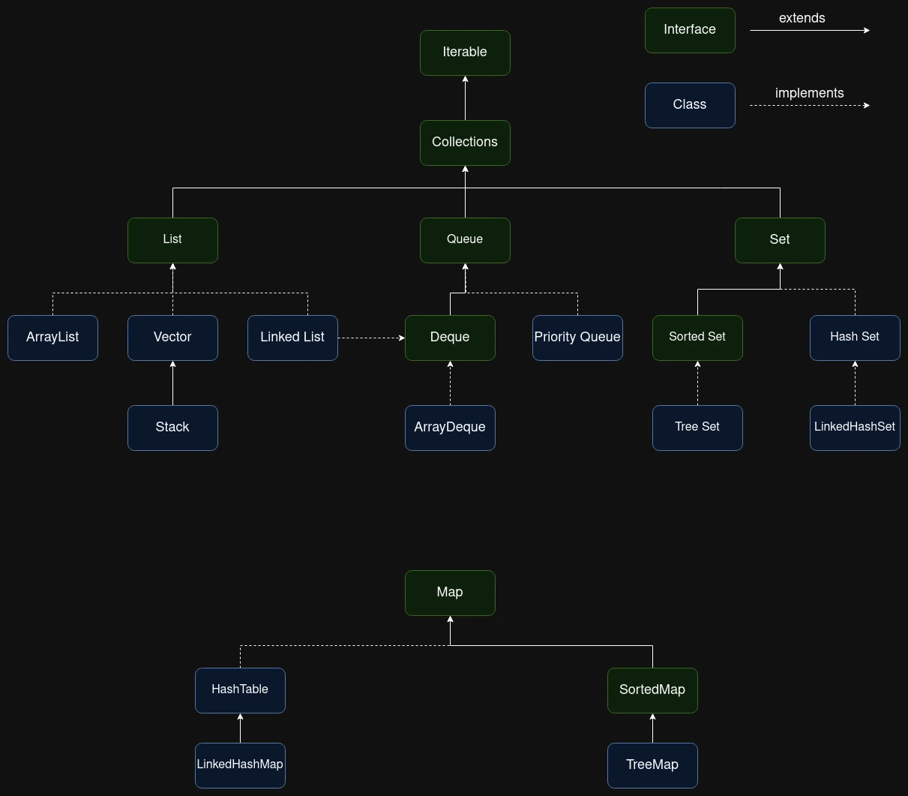

## Collection
Collection is a group of objects.

## Collection framework
- Collection framework is a collection of interfaces and implemented classes.
- Collection framework provides implementations of data structures & algorithms by which we can store and process information without implementing them.

## Data Structures
- Data structures are used to organize the data.
- We can perform operations quickly and easily on organized data.

### Types of Data Structures
1. **Linear Data structures**: Arrange data sequentially in which elements are connected to its previous and next adjacent.
**Examples**: Arrays, Stacks, Linked Lists, Queues
2. **Non - Linear Data structures**: Data is arranged in two dimensional or multi dimensional format, where one element is connected to multiple elements.
**Examples**: Trees, Graphs, Tables, Sets

## Collection Hierarchy

### Array vs Collections
- Array is static(fixed size)
- Collection is dynamic(size grows and shrinks as elements get inserted or deleted)

### List
- List is index based
- List allows duplicate values

#### List is implemented by

1. **Array List**
    - Accessing of elements is much faster
    - Insertions and deletions are slower - shifting of elements takes time

2. **Vector**
    - Accessing of elements is much faster
    - Insertions and deletions are slower - shifting of elements takes time

3. **Stack**
    - Stack follows Last In First Out (LIFO)
    - Inserting and removing of elements from one end(TOP)

4. **Linked List**
    - Accessing elements is slower, nodes based access.
    - Inserting and deleting of elements is faster. Shifting of elements is not possible.

### Set
- Set is not index based.
- Duplicates are not allowed.

#### Set is implemented by

1. **HashSet**: Doesnot maintain insertion order.
2. **LinkedHashSet**: Maintains insertion order.
3. **TreeSet**: Maintains sorted order.

### Map
- Map is not index based.
- Map stores elements using keys. Keys must be unique. Elements can be duplicate.

#### Map is implemented by
1. **HashTable**: Maintains sorted order using Keys. **Null keys are not allowed**.
2. **HashMap**: Doesnot maintain insertion order. **One null** key is allowed.
3. **LinkedHashMap**: Maintains insertion order. **One null** key is allowed.
4. **TreeMap**: Maintain sorted order using Keys. **Null keys are not allowed**.

### Queue
- Queue follows First In First Out (FIFO) order.

#### Queue is implemeted by
1. **Priority Queue**: It is not an order collection and allows duplicates. Priority queue elements are retrived in sorted order. Head of priority queue will be the smallest element. Once this element is retrived, the next smallest element will be the head of queue.

