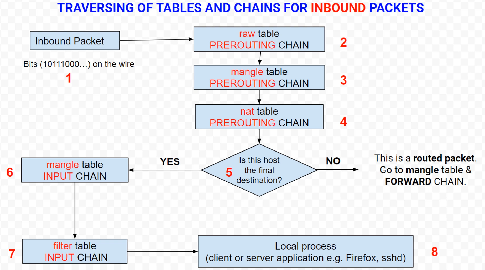
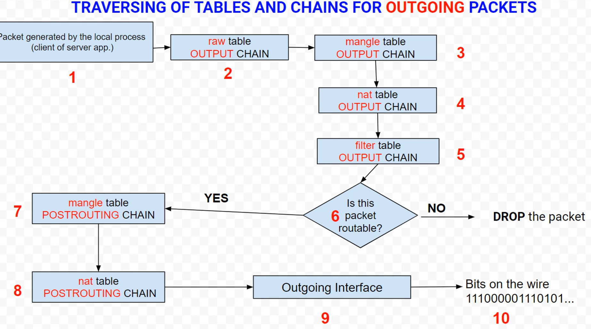
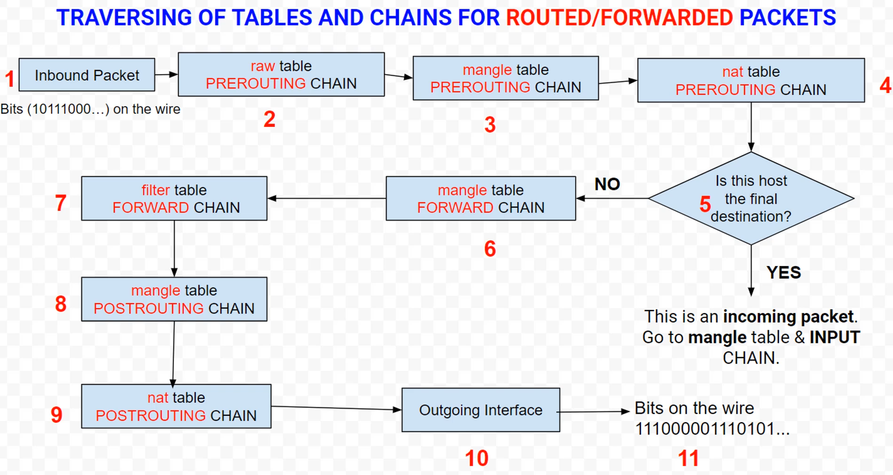
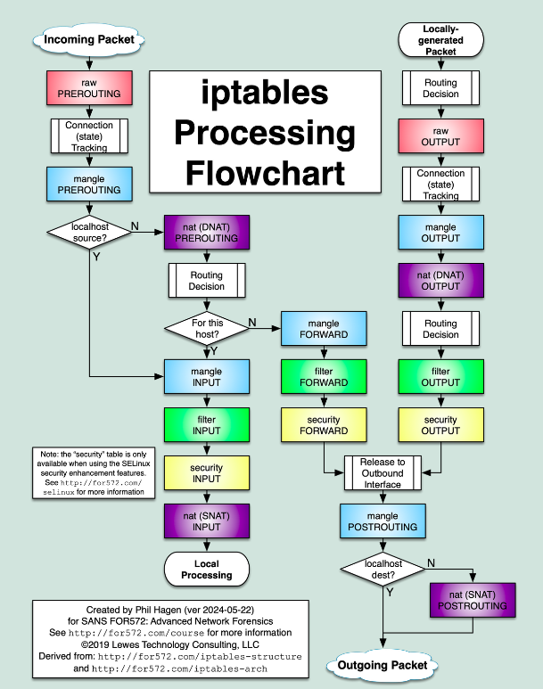

A packet can be found in one of the following scenario's

1. It comes from the network and is destined for our host, which is the final desination

> PREROUTING -> INPUT

2. It comes from the network but it's not destined for our host. The packet must be routed by the linux machine.

> PREROUTING -> FORWARD -> POSTROUTING

3. Packet is generated by ana application on the host.

> LOCAL APPLICATION -> OUTPUT -> POSTROUTING

### Traversing of Tables and Chains for INBOUND traffic

### Traversing of Tables and Chains for OUTBOUND traffic

### Traversing of Tables and Chains for FORWARD/ROUTED traffic

### IpTables flowchart

