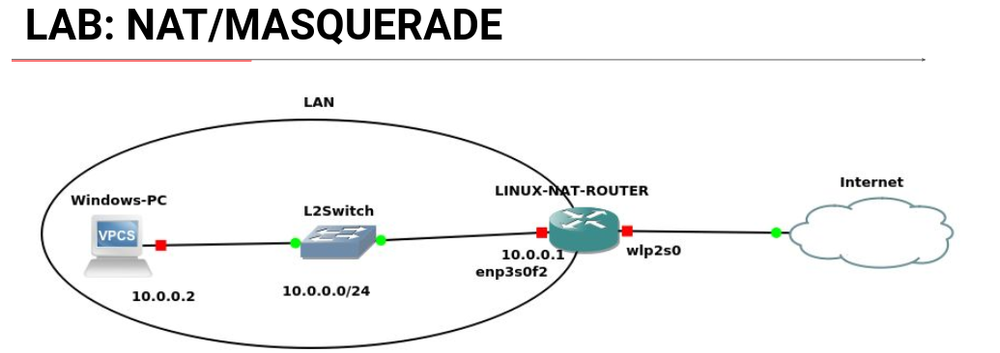
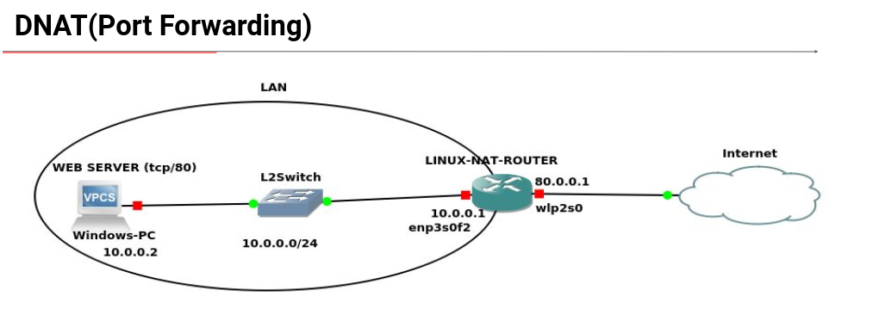

## NAT

NAT => Network Address Translation

- NAT involves re-writing the source and/or destination addresses of IP packets as they pass through a router or firewall.

### SNAT

- SNAT replaces the private ip address from the packet with the public IP address of the router external interface.
- Netfilter framework enables a linux machine with an appropriate number of network cards (interfaces) to become a router capable of NAT.
- SNAT uses the NAT table and the ***POSTROUTING*** chain.

### MASQUERADE

- MASQUERADE is a special case of SNAT used when the public IP address of the NAT router is dynamic.
- It will automatically use the IP address of the outgoing network interface translation.

- When using NAT or MASQUERADE the netfilter also performs port address translation (PAT) on the packet.


#### Configuration

1. Enable the routing process

#### Option A:

```sh
echo "1" > /proc/sys/net/ipv4/ip_forward
```

#### Option B:

Edit `/etc/sysctl.conf` add `net.ipv4.ip_forward=1` and restart the network service.


2. Add an iptables rule to nat table and POSTROUTING chain that matches packets that should be NATed, specify the external interface using `-o` option and use `-j SNAT --to-source public_ip_address` or `-j MASQUERADE` targets.


##### Examples:

```sh
iptables -t nat -A POSTROUTING -s 10.0.0.0/24 -o eth -j SNAT --to-source 80.0.0.1
```

(or)

```sh
# the MASQUERADE will auto matically take the IP address of the eth0 interface
iptables -t nat -A POSTROUTING -s 10.0.0.0/24 -o eth -j MASQUERADE
```

#### Configuring NAT/MASQUERADE



1. Enable routing on linux NAT router
2. Define iptables rules that match NAT traffic and use `-j SNAT --to-source IP` or `-j MASQUERADE` targets.

```sh
# Enable forwarding
echo "1" > /proc/sys/net/ipv4/ip_forward
```

```sh
# We can use the -j SNAT when we know the public ip address 
# else we can use the -j MASQUERADE when the public IP address changes Dynamically
iptables -t nat -A POSTROUTING -s 10.0.0.0/24 -o wlo1 -j MASQUERADE
```


### DNAT

- DNAT permits connections from the internet to servers with private IP addresses inside the LAN.
- The client connects to the public IP address of the DNAT Router which in turn redirects traffic to the private server.
- The server with the private IP address stays invisible.
- DNAT uses `nat` table and `PREROUTING` chain.
- Target used is `-j DNAT --to-destination private_ip_address`
- PORT forwarding is always done on the `PREROUTING` chain

#### Configuring DNAT



1. It is assumed that SNAT is configured for traffic generated from the LAN server to internet.
2. Define iptables rule that matches traffic that comes from the internet and use `-j DNAT --to-destination LAN_SERVER_IP` target.

```sh
# on the LINUX router
iptables -t nat -A PREROUTING -p tcp --dport 80 -j DNAT --to-destination 10.0.0.2:80

iptables -t nat -A PREROUTING -p tcp --dport 8080 -j DNAT --to-destination 10.0.0.2:80
```


